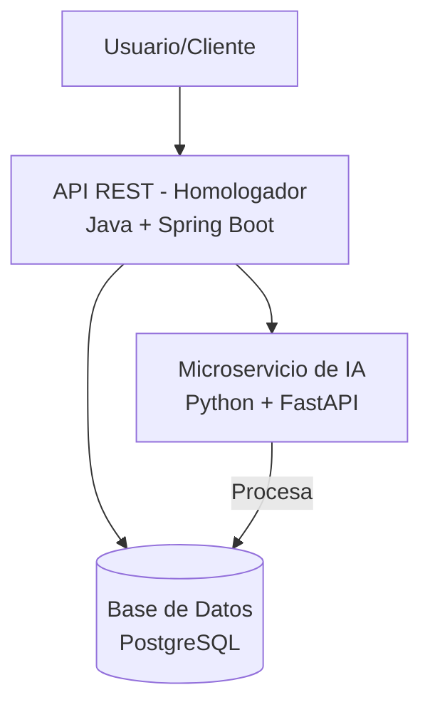

# 🚗 Homologador de Autos con IA

Este proyecto es una API REST diseñada para resolver el problema de la estandarización de descripciones de vehículos entre diferentes catálogos de aseguradoras. Utiliza un microservicio de Inteligencia Artificial para analizar semánticamente las descripciones y encontrar las coincidencias más relevantes.

---

## 📝 Descripción del Problema

Diferentes aseguradoras describen el mismo vehículo de formas muy distintas (ej. "Civic Turbo Plus TA" vs. "Civic Turbo Automático Piel"), lo que dificulta la unificación y comparación de datos. Esta API recibe los datos de un vehículo y devuelve una lista de las versiones más parecidas en cada catálogo de aseguradora, ordenadas por similitud.

---

## 🏛️ Arquitectura

El sistema está construido con una arquitectura de microservicios para separar la lógica de negocio de la lógica de IA, permitiendo escalabilidad y mantenimiento independientes.



---

## 🛠️ Tecnologías Utilizadas

### Backend (API de Negocio)
* **Java 17:** Lenguaje principal, versión LTS robusta y moderna.
* **Spring Boot 3:** Framework para la creación rápida de APIs REST.
* **Spring Data JPA / Hibernate:** Para el mapeo objeto-relacional (ORM) y la comunicación con la base de datos.
* **Maven:** Gestor de dependencias y construcción del proyecto.

### Servicio de IA (Microservicio de Inteligencia)
* **Python 3.9+:** Lenguaje líder en el ecosistema de Machine Learning.
* **FastAPI:** Framework web de alto rendimiento para crear el servicio de IA.
* **Sentence-Transformers:** Librería para utilizar modelos de IA (como S-BERT) que convierten texto en vectores semánticos.
* **Uvicorn:** Servidor ASGI para FastAPI.

### Base de Datos y Herramientas
* **PostgreSQL:** Base de datos relacional, potente y de código abierto.
* **Docker & Docker Compose:** Para crear un entorno de desarrollo consistente y gestionar el servicio de la base de datos.

---

## 🚀 Puesta en Marcha

Sigue estos pasos para levantar el proyecto completo en tu entorno local.

### Prerrequisitos
* Java (JDK) 17 o superior.
* Maven 3.6 o superior.
* Python 3.9 o superior.
* Docker y Docker Compose.

### Instalación
1. **Clona el repositorio:**
    ```sh
    git clone [URL-DE-TU-REPOSITORIO]
    cd [NOMBRE-DE-LA-CARPETA]
    ```

2. **Levanta la Base de Datos:**
    Asegúrate de que Docker Desktop esté corriendo y ejecuta:
    ```sh
    docker-compose up -d
    ```

3. **Inicia el Servicio de IA (Python):**
    ```sh
    cd homologador-ia-python
    python -m venv venv
    # Windows: .\venv\Scripts\activate | macOS/Linux: source venv/bin/activate
    pip install -r requirements.txt
    uvicorn main:app --reload --port 8001
    ```

4. **Inicia la API Backend (Java):**
    ```sh
    cd homologador-api-java
    mvn spring-boot:run
    ```

5. **Carga Inicial de Datos (Ingestión):**
    La **primera vez** que arranques la aplicación Java, el `DataIngestionService` se activará para poblar la base de datos. Este proceso puede tardar unos minutos.

---

## ⚙️ Uso de la API

Una vez que todos los servicios estén corriendo, puedes hacer peticiones al endpoint principal.

**Endpoint:** `POST /api/homologador/buscar`

**Ejemplo de Petición con `curl`:**
```sh
curl -X POST http://localhost:8080/api/homologador/buscar \
-H "Content-Type: application/json" \
-d '{
    "marca": "ACURA",
    "submarca": "MDX",
    "ano": 2009,
    "version": "SUV Automático con Piel"
}'
```

**Respuesta esperada (ejemplo):**
```json
{
    "chubb": [
        "MDX SUV AUT CA\tMDX  SUV  V6  IPC  AUT  4  ABS  CA  CE  PIEL  CD  CQ  CB"
    ],
    "mapfre": [
        "ACURA MDX 3.7 5V AUT ABS"
    ],
    "gnp": [
        "ACURA MDX                                       "
    ]
}
```

---

## 🔮 Mejoras a Futuro
- [ ] Migrar a una Base de Datos Vectorial: Utilizar la extensión pgvector en PostgreSQL para acelerar las búsquedas de similitud a gran escala.
- [ ] Implementar Caché: Usar Redis o Caffeine para cachear los resultados de las búsquedas más frecuentes y mejorar los tiempos de respuesta.
- [ ] Bucle de Retroalimentación (Feedback Loop): Crear un endpoint para que los usuarios puedan confirmar si una coincidencia es correcta, y usar esos datos para re-entrenar y mejorar el modelo de IA.
- [ ] Homologación por Lotes: Permitir la subida de un archivo (CSV/JSON) para procesar múltiples vehículos en una sola petición.
```
